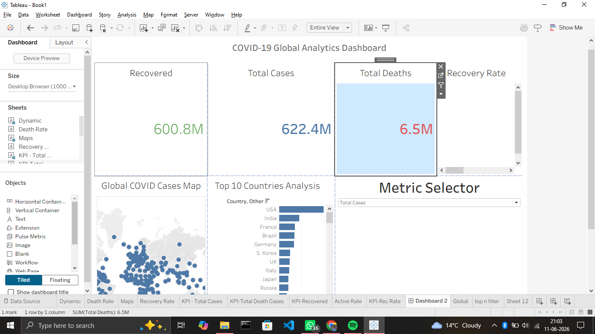
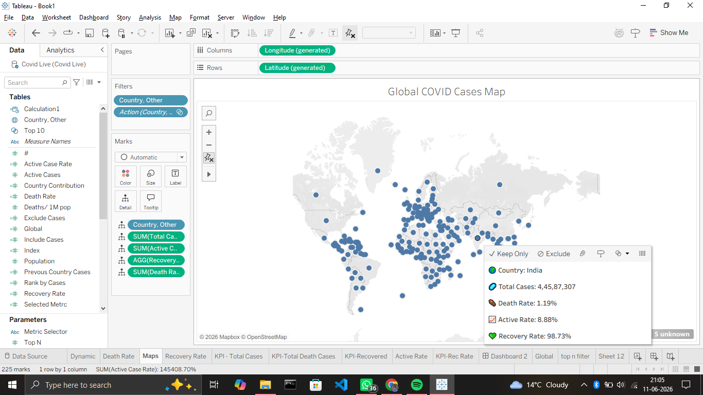

# COVID-19 Data Analysis & Visualization Dashboard

## Project Overview

This project presents an interactive Tableau dashboard analyzing global COVID-19 trends.

## Tools Used

- Tableau
- Excel / CSV
- Data Analytics
- Data Visualization

## Features

- KPI Cards
- Global Case Analysis
- Country-wise Comparison
- Interactive Filters
- Geographic Visualization

## Dashboard Screenshots

### Dashboard Overview

### World Map

### Trend Analysis

## Author

Sai Saravan Pradeep Katikila
